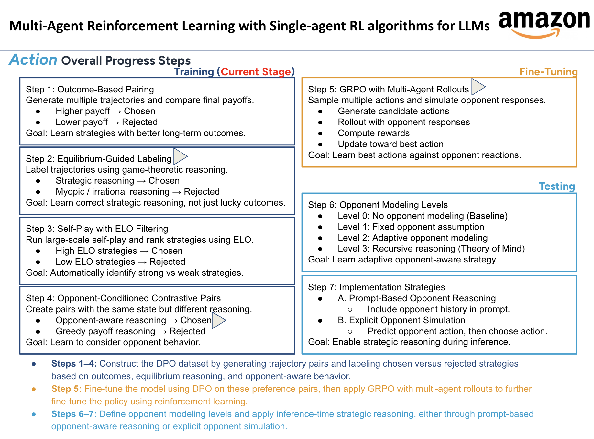

# Multi-Agent RL with Single-Agent RL for LLMs



This project implements a 7-step pipeline for training opponent-aware policies in Iterated Prisoner's Dilemma using DPO + GRPO.

---

# Pipeline Overview

Steps 1–4: Preference dataset construction  
Step 5: GRPO fine-tuning  
Step 6: Opponent modeling evaluation  
Step 7: Inference-time reasoning strategies  

---

# Scripts

## step1_step4.py — DPO Dataset Construction
Generates preference pairs using simulated rollouts.

Includes:
- Step 1: Outcome-based pairing (long-term payoff comparison)
- Step 2: Equilibrium-guided labeling
- Step 3: Self-play ranking
- Step 4: Opponent-conditioned contrastive pairs

Output:
```
ipd_dpo/output/*.jsonl
```

---

## step5.py — GRPO Multi-Agent Fine-Tuning
Trains policy network using GRPO-style updates with opponent rollouts.

Process:
- Sample candidate actions
- Simulate opponent responses
- Compute discounted returns
- Update policy toward best actions

Output:
```
output/step5_grpo_ckpt/policy_final.pt
```

---

## step6.py — Opponent Modeling Levels Evaluation
Evaluates trained policy under different opponent reasoning levels:

- Level 0: No opponent modeling
- Level 1: Fixed opponent assumption
- Level 2: Adaptive opponent modeling
- Level 3: Recursive reasoning

Output:
```
output/step6/level_results.csv
```

---

## step7.py — Inference Strategy Comparison
Compares two inference-time reasoning strategies:

A. Prompt-Based Opponent Reasoning  
B. Explicit Opponent Simulation  

Computes one-step reward against each opponent.

Output:
```
output/step7/strategy_results.csv
output/step7/strategy_summary.csv
```

---

# Run Order

```bash
python step1_step4.py
python step5.py
python step6.py
python step7.py
```

---

# Requirements

See requirements.txt
